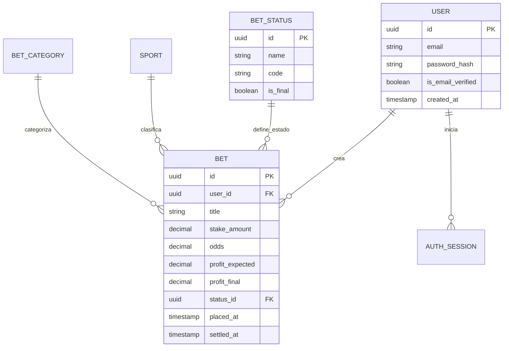

<div align="center">

# 📊 RegistroBet

**Gestiona tus apuestas deportivas de forma inteligente.**

[](https://www.djangoproject.com/)
[](https://react.dev/)
[](https://www.typescriptlang.org/)
[](https://tailwindcss.com/)
[](https://www.postgresql.org/)
[](https://sonarcloud.io/)

[Demo en vivo](https://registro-bet.vercel.app) · [API](https://registro-bet.onrender.com/api/)

</div>

---

## 📋 Problemática

Muchas personas que realizan apuestas deportivas gestionan sus registros a través de **hojas de cálculo en Excel**. Si bien funciona, este enfoque presenta varios problemas:

- **Lento y tedioso** — Crear filas, escribir fórmulas de ganancia, retorno y balance manualmente toma tiempo.
- **Propenso a errores** — Un error en una fórmula puede afectar todo el historial sin que lo notes.
- **Sin resumen visual rápido** — Para ver cuánto ganaste en un rango de fechas hay que armar gráficos o tablas pivote.
- **No accesible desde el celular** — Consultar o registrar una apuesta desde el móvil en una hoja de cálculo es incómodo.

---

## 💡 Solución

**RegistroBet** es una aplicación web (con soporte PWA) que reemplaza al Excel por completo:

1. **Registro rápido** — Solo ingresás monto, cuota y ganancia esperada. La app hace los cálculos.
2. **Dashboard en tiempo real** — Ganancia neta total, retorno total y total apostado de un vistazo.
3. **Cambio de estado con un clic** — Toca el badge "Pendiente" directamente en la tabla para marcar como Ganada, Perdida o Nula.
4. **Historial con filtros** — Filtrá por rango de fechas y obtené resumen de ganado, perdido y balance neto al instante.
5. **Responsive** — Diseñado mobile-first para registrar apuestas desde cualquier lugar.
6. **PWA instalable** — Podés instalarla como app nativa en tu celular o escritorio.

---

## 🏗️ Arquitectura

El proyecto sigue **Clean Architecture por features** en el backend, separando cada módulo en capas independientes:

```
backend/src/apps/{feature}/
├── domain/           # Entidades, Value Objects, Repositorios (interfaces)
├── application/      # Casos de uso (lógica de negocio)
├── infrastructure/   # Implementaciones concretas (Django ORM, etc.)
└── presentation/     # Serializers, Views, URLs (API REST)
```

### Patrones de diseño utilizados

| Patrón                   | Uso                                           |
| ------------------------ | --------------------------------------------- |
| **Repository Pattern**   | Abstrae el acceso a datos del ORM             |
| **Service Layer**        | Casos de uso encapsulan la lógica de negocio  |
| **DTO / Serializer**     | Comunicación limpia entre capas y la API      |
| **Dependency Inversion** | Testing y desacoplamiento entre capas         |
| **Value Objects**        | `Money`, `Odds` — validación a nivel de dominio |

---

## 🛠️ Stack tecnológico

### Backend

| Tecnología | Versión | Por qué |
|---|---|---|
| **Python** | 3.13+ | Últimas mejoras de performance y tipado |
| **Django** | 6.0 | Framework robusto con ORM, migraciones y admin listo |
| **Django REST Framework** | 3.16 | Serialización, validación y vistas API estándar de la industria |
| **PostgreSQL** | 17 | BD relacional sólida, UUIDs nativos, JSONB para auditoría |
| **JWT (PyJWT)** | 2.11 | Autenticación stateless con access + refresh tokens |
| **SendGrid** | 6.12 | Envío de emails transaccionales (verificación, recuperación) |
| **UV** | — | Gestor de paquetes ultra rápido para Python |
| **Gunicorn** | 25.1 | Servidor WSGI para producción |
| **WhiteNoise** | 6.12 | Servir archivos estáticos sin Nginx |
| **drf-spectacular** | 0.29 | Documentación OpenAPI/Swagger auto-generada |

### Frontend

| Tecnología | Versión | Por qué |
|---|---|---|
| **React** | 19 | Librería UI con el nuevo compilador y hooks mejorados |
| **TypeScript** | 5.9 | Tipado estático, autocompletado y prevención de errores |
| **Vite** | — | Build tool ultra rápido con HMR instantáneo |
| **Tailwind CSS** | 4 | Utility-first CSS, diseño rápido y consistente |
| **TanStack Query** | 5 | Cache, revalidación y sincronización de datos del servidor |
| **React Hook Form + Zod** | 7 + 4 | Formularios performantes con validación basada en esquemas |
| **Zustand** | 5 | Estado global minimalista (auth store) |
| **React Router** | 7 | Enrutamiento declarativo con rutas protegidas |
| **Framer Motion** | 12 | Animaciones fluidas en cards y transiciones |
| **Lucide React** | — | Íconos SVG limpios y tree-shakeable |
| **Vite PWA** | 1.2 | Progressive Web App instalable con service worker |

### Infraestructura y DevOps

| Servicio | Uso |
|---|---|
| **Vercel** | Hosting del frontend (deploy automático desde GitHub) |
| **Render** | Hosting del backend (free tier + build script) |
| **Supabase** | Base de datos PostgreSQL gestionada en la nube |
| **cron-job.org** | Ping cada 10 min al health check para evitar cold sleep de Render |
| **SonarCloud** | Análisis estático de código, cobertura y code smells |
| **Docker Compose** | Entorno de desarrollo local con PostgreSQL 17 |
| **GitHub** | Control de versiones y CI pipeline |

---

## 📦 Modelo de datos



### Estados de una apuesta

| Estado | Código | Descripción |
|---|---|---|
| Pendiente | `pending` | Estado por defecto al crear |
| Ganada | `won` | La apuesta fue acertada |
| Perdida | `lost` | La apuesta fue fallida |
| Nula | `void` | Sin efecto en el balance (se devuelve el stake) |

---

## 🔐 Autenticación

- Registro con verificación de email (enlace único vía SendGrid)
- Login solo si el email está verificado
- JWT con access token + refresh token
- Recuperación de contraseña con código temporal (expira en 10 min)
- Cambio de contraseña invalida todas las sesiones activas

---

## 🚀 Endpoints principales

| Método | Ruta | Descripción |
|---|---|---|
| `GET` | `/api/health/` | Health check |
| `POST` | `/api/users/register/` | Registro de usuario |
| `POST` | `/api/users/login/` | Login (obtener tokens) |
| `POST` | `/api/users/refresh/` | Refrescar access token |
| `POST` | `/api/users/logout/` | Cerrar sesión |
| `GET` | `/api/bets/` | Listar apuestas del día |
| `POST` | `/api/bets/` | Crear apuesta |
| `PATCH` | `/api/bets/{id}/` | Editar apuesta |
| `DELETE` | `/api/bets/{id}/` | Eliminar apuesta |
| `PATCH` | `/api/bets/{id}/status/` | Cambiar estado |
| `GET` | `/api/bets/balance/daily/` | Balance del día |
| `GET` | `/api/bets/balance/total/` | Balance total acumulado |
| `GET` | `/api/bets/history/` | Historial por rango de fechas |
| `GET` | `/api/bets/statuses/` | Catálogo de estados |


---

## 🧪 Tests


El proyecto cuenta con **247+ tests** cubriendo casos de uso, repositorios, vistas y validaciones.

---

## 📁 Estructura del proyecto

```
registro-bet/
├── backend/                  # API REST (Django + DRF)
│   ├── src/
│   │   ├── api/              # Router central de URLs
│   │   ├── apps/
│   │   │   ├── users/        # Auth, sesiones, perfil
│   │   │   ├── bets/         # Apuestas, balance, historial
│   │   │   └── audit/        # Logs de auditoría
│   │   ├── config/           # Settings, WSGI, ASGI
│   │   └── shared/           # Código compartido
│   ├── build.sh              # Script de deploy para Render
│   └── pyproject.toml        # Dependencias y configuración
│
├── frontend/                 # SPA (React + TypeScript)
│   ├── src/
│   │   ├── app/              # Router, providers
│   │   ├── features/
│   │   │   ├── auth/         # Login, registro, verificación
│   │   │   └── bets/         # Dashboard, historial, formularios
│   │   ├── shared/           # Componentes, hooks, layouts
│   │   └── styles/           # Tailwind CSS
│   └── vite.config.ts        # Vite + PWA config
│
├── docs/                     # Documentación del proyecto
├── docker-compose.yml        # PostgreSQL local
└── sonar-project.properties  # Configuración SonarCloud
```


<div align="center">

Hecho con ☕ y código por **Marcwos**

</div>
