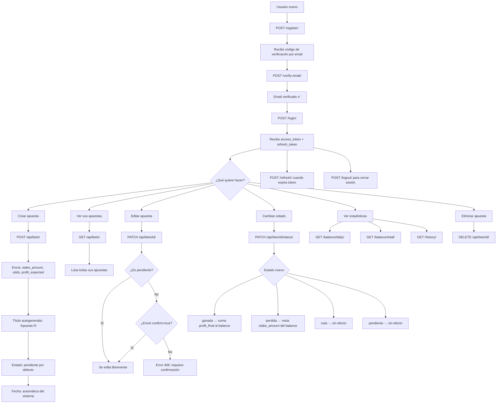
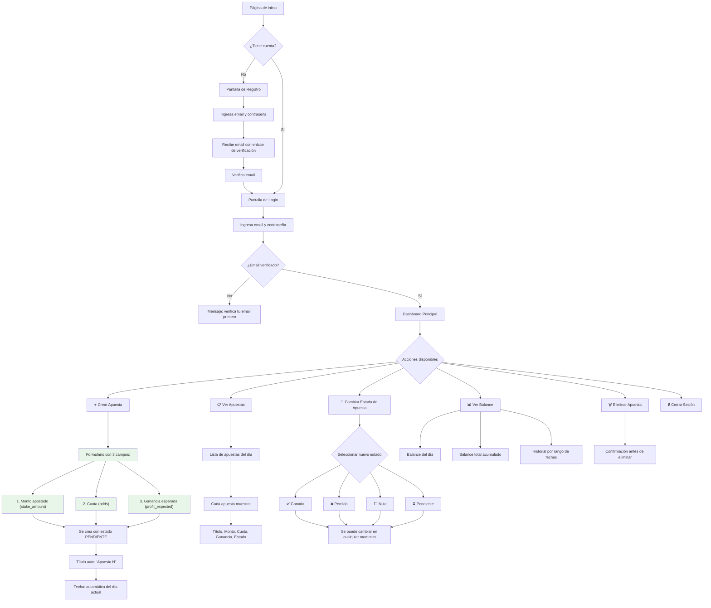
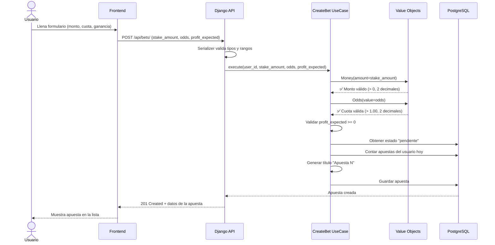
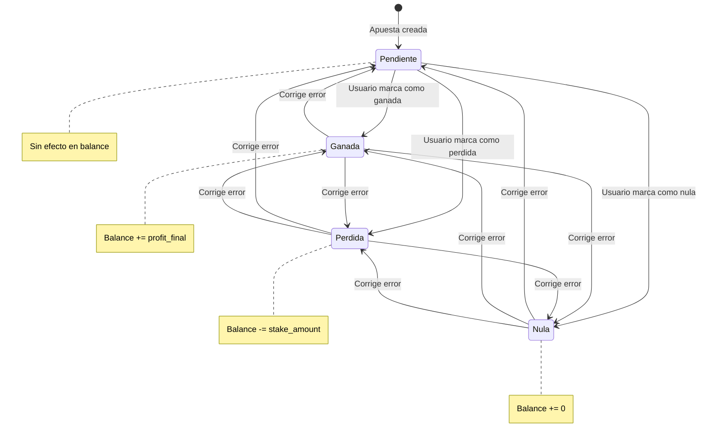

# Diagramas de Flujo — Registro Bet

[← Volver al índice](./README.md)

---

## 1. Flujo Actual del Usuario (Backend implementado)

> Muestra el flujo completo que soporta el backend actualmente con todos los endpoints.

---

## 2. Flujo del Usuario en el Frontend (Versión final esperada)

> Muestra cómo interactuará el usuario con la aplicación a través del frontend.
> Solo los campos visibles y las acciones disponibles para el usuario final.

---

## 3. Flujo de Creación de Apuesta — Detalle técnico

> Cómo fluye la data desde el frontend hasta la base de datos.

---

## 4. Flujo de Cambio de Estado

> Cómo funciona el cambio de estado y su impacto en el balance.

---

## Campos visibles por contexto

| Campo | Frontend (usuario) | Backend (API) | Base de datos |
|---|---|---|---|
| Monto apostado | ✅ Ingresa | ✅ Requerido | `stake_amount` |
| Cuota | ✅ Ingresa | ✅ Requerido | `odds` |
| Ganancia esperada | ✅ Ingresa | ✅ Requerido | `profit_expected` |
| Estado | ✅ Cambia | ✅ Requerido | `status_id` |
| Título | ❌ Autogenerado | ✅ Autogenerado | `title` |
| Fecha | ❌ Automática | ✅ Automática | `placed_at` |
| Descripción | ❌ No visible (v1) | ✅ Opcional | `description` |
| Deporte | ❌ No visible (v1) | ✅ Opcional | `sport_id` |
| Categoría | ❌ No visible (v1) | ✅ Opcional | `category_id` |
| Ganancia real | ❌ No visible (v1) | ✅ Opcional | `profit_final` |
