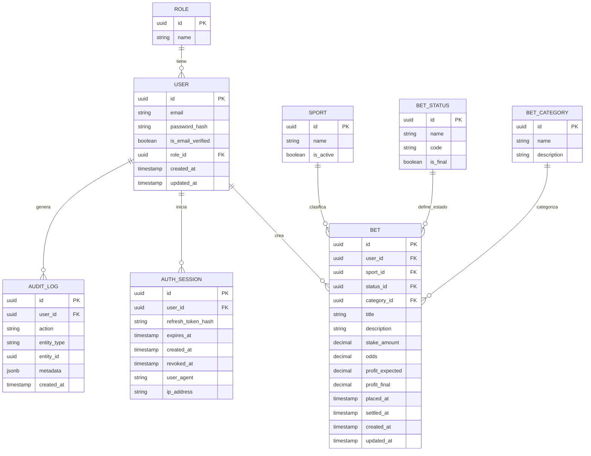

# Modelo Entidad-Relación

[← Volver al índice](./README.md)

---

## Diagrama ER

---

## Relaciones

| Relación                  | Tipo   | Descripción                              |
| ------------------------- | ------ | ---------------------------------------- |
| `ROLE` → `USER`           | 1 a N  | Un rol tiene muchos usuarios             |
| `USER` → `BET`            | 1 a N  | Un usuario crea muchas apuestas          |
| `USER` → `AUTH_SESSION`   | 1 a N  | Un usuario inicia muchas sesiones        |
| `USER` → `AUDIT_LOG`      | 1 a N  | Un usuario genera muchos logs            |
| `SPORT` → `BET`           | 1 a N  | Un deporte clasifica muchas apuestas     |
| `BET_STATUS` → `BET`      | 1 a N  | Un estado define muchas apuestas         |
| `BET_CATEGORY` → `BET`    | 1 a N  | Una categoría agrupa muchas apuestas     |
