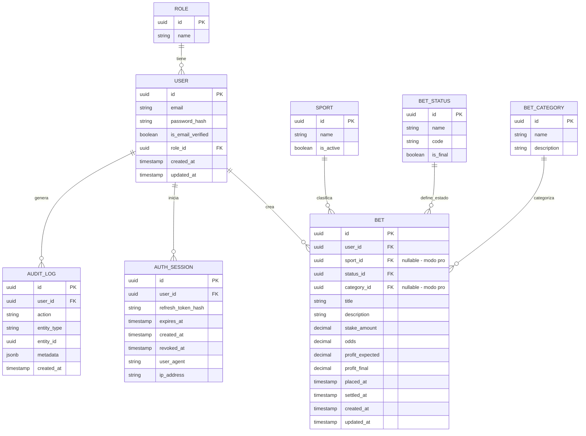

# Modelo Entidad-Relación

[← Volver al índice](./README.md)

---

## Diagrama ER

---

## Relaciones

| Relación                  | Tipo   | Descripción                              |
| ------------------------- | ------ | ---------------------------------------- |
| `ROLE` → `USER`           | 1 a N  | Un rol tiene muchos usuarios             |
| `USER` → `BET`            | 1 a N  | Un usuario crea muchas apuestas          |
| `USER` → `AUTH_SESSION`   | 1 a N  | Un usuario inicia muchas sesiones        |
| `USER` → `AUDIT_LOG`      | 1 a N  | Un usuario genera muchos logs            |
| `SPORT` → `BET`           | 1 a N  | Un deporte clasifica muchas apuestas (nullable, modo pro)    |
| `BET_STATUS` → `BET`      | 1 a N  | Un estado define muchas apuestas         |
| `BET_CATEGORY` → `BET`    | 1 a N  | Una categoría/tipo agrupa muchas apuestas (nullable, modo pro) |

---

## Catálogos de Apuestas

> Los campos `sport_id` y `category_id` en `BET` son **nullable** porque solo se usan en **modo pro**.
> En modo normal, el usuario no los ve ni los completa.

| Catálogo       | Representa             | Ejemplos                                              |
| -------------- | ---------------------- | ----------------------------------------------------- |
| `SPORT`        | El deporte             | Fútbol, Tenis, MMA, Basketball, eSports               |
| `BET_CATEGORY` | Tipo/formato de apuesta | Simple, Combinada (2), Combinada (3-5), Combinada (6+) |

Estas dos dimensiones permiten estadísticas cruzadas en modo pro:
*"Ganás más en apuestas simples de fútbol que en combinadas de tenis"*.
