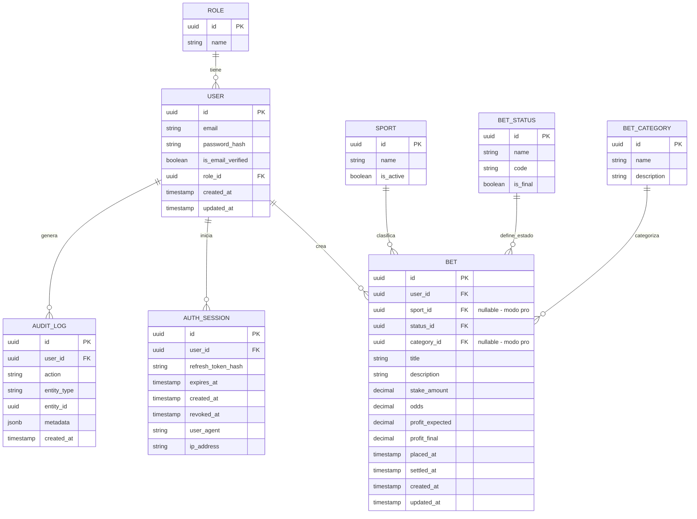

# Registro Bet — Avance del Proyecto

> **Web privada para gestionar apuestas deportivas.**
> Reemplaza Excel con una experiencia más intuitiva y visual, enfocada en saber si el usuario gana o pierde.

---

## Índice

1. [Stack Tecnológico](#stack-tecnológico)
2. [Arquitectura](#arquitectura)
3. [Modelo Entidad-Relación](#modelo-entidad-relación)
4. [Reglas de Negocio](#reglas-de-negocio)
5. [Endpoints Implementados](#endpoints-implementados)
6. [Tests](#tests)
7. [Lo Implementado (Sprints 1-5)](#lo-implementado)
8. [Lo Pendiente (Sprints 6-7)](#lo-pendiente)
9. [Resumen Visual](#resumen-visual)

---

## Stack Tecnológico

| Capa | Tecnología |
|---|---|
| Backend | Django + Django REST Framework |
| Base de datos | PostgreSQL |
| Autenticación | JWT + Refresh Token (tabla `auth_sessions`) |
| Documentación API | drf-spectacular (Swagger / Redoc) |
| Contenedores | Docker + Docker Compose |
| Linter/Formatter | Ruff |
| Pre-commit hooks | trailing-whitespace, end-of-file, ruff, ruff-format |
| Testing | pytest + unittest.mock |
| Análisis estático | SonarQube |

---

## Arquitectura

### Clean Architecture por Features

Cada módulo (`users`, `bets`) se organiza de forma independiente en 4 capas:

```
src/apps/{feature}/
├── domain/            ← Entidades, Value Objects, Repositorios (abstractos), Excepciones, Servicios
├── application/       ← Use Cases (1 archivo = 1 caso de uso)
├── infrastructure/    ← Models Django, Repositorios concretos, Mappers
└── presentation/      ← Views (APIView), Serializers, URLs
```

**Flujo de dependencias:** Presentación → Aplicación → Dominio ← Infraestructura

### Patrones de Diseño

| Patrón | Uso |
|---|---|
| Repository Pattern | Acceso a datos (puerto abstracto en dominio, implementación en infra) |
| Use Case / Application Service | 1 caso de uso = 1 clase con método `execute()` |
| Value Objects | `Money` (monto > 0, 2 decimales), `Odds` (cuota > 1.00, 2 decimales) |
| Domain Service | `BalanceCalculator` (cálculos de balance desde datos reales) |
| Mapper | Conversión entidad ↔ modelo ORM |
| Dependency Inversion | Use cases reciben repositorios abstractos, inyectados desde la vista |
| DTO / Serializer | Validación de entrada y formato de salida en la API |

---

## Modelo Entidad-Relación



### Relaciones

| Relación | Tipo | Descripción |
|---|---|---|
| `ROLE` → `USER` | 1 a N | Un rol tiene muchos usuarios |
| `USER` → `BET` | 1 a N | Un usuario crea muchas apuestas |
| `USER` → `AUTH_SESSION` | 1 a N | Un usuario inicia muchas sesiones |
| `SPORT` → `BET` | 1 a N | Un deporte clasifica muchas apuestas (nullable, modo pro) |
| `BET_STATUS` → `BET` | 1 a N | Un estado define muchas apuestas |
| `BET_CATEGORY` → `BET` | 1 a N | Una categoría agrupa muchas apuestas (nullable, modo pro) |

---

## Reglas de Negocio

### Propiedad y Privacidad
- **R1:** Cada usuario solo puede ver y modificar sus propias apuestas
- **R2:** El admin NO puede ver apuestas individuales ni datos sensibles
- **R3:** El admin solo accede a métricas agregadas
- **R4:** Las apuestas eliminadas desaparecen para el usuario pero se registra en auditoría

### Ciclo de Vida de una Apuesta
- **R5:** Una apuesta inicia siempre en `pendiente`
- **R6:** Solo apuestas pendientes pueden editarse libremente
- **R7:** Se puede cambiar de estado en cualquier momento (rollback permitido)
- **R8:** Cambiar estado recalcula balances automáticamente
- **R9:** La fecha se asigna por sistema pero puede editarse para registrar apuestas pasadas

### Impacto en el Balance

| Estado | Impacto |
|---|---|
| `pendiente` | No afecta balance |
| `ganada` | `+profit_final` |
| `perdida` | `-stake_amount` |
| `nula` | 0 |

### Integridad de Datos
- **R14:** Monto apostado > 0
- **R15:** Cuota > 1.00
- **R16:** Valores monetarios en USD con 2 decimales
- **R17:** Toda apuesta debe tener estado válido

### Cálculos del Sistema

| Métrica | Cálculo |
|---|---|
| Suma de ganancias | Σ `profit_final` de apuestas ganadas |
| Suma de pérdidas | Σ `stake_amount` de apuestas perdidas |
| Profit neto | Ganancias − Pérdidas |
| Conteo por estado | COUNT agrupado por `status` |

### Seguridad y Sesiones
- **R21:** "Recordarme" mantiene sesión 7 días
- **R22/R32:** Cambiar contraseña invalida TODAS las sesiones activas
- **R24:** Solo usuarios con correo verificado pueden hacer login
- **R27:** Código de recuperación expira en 10 minutos
- **R28:** Código de recuperación es de un solo uso
- **R29:** Solo el último código generado es válido
- **R30:** Límite de intentos para introducir código
- **R31:** Solicitar recuperación no revela si el correo existe

### Modos de Uso
- **Modo normal (v1):** Campos básicos (monto, cuota, ganancia, estado)
- **Modo pro (futuro):** Agrega deporte (`Sport`) y tipo de apuesta (`BetCategory`)
- Los campos `sport_id` y `category_id` son nullable para soportar ambos modos

---

## Endpoints Implementados

### Users (`/api/users/`)

| Método | Endpoint | Descripción | Auth |
|---|---|---|---|
| POST | `/register/` | Registro de usuario | No |
| POST | `/login/` | Login (requiere email verificado) | No |
| POST | `/logout/` | Cerrar sesión | JWT |
| POST | `/refresh/` | Renovar tokens | No |
| POST | `/send-verification/` | Enviar código de verificación al email | No |
| POST | `/verify-email/` | Verificar email con código | No |
| POST | `/recover-password/` | Solicitar código de recuperación | No |
| POST | `/reset-password/` | Resetear contraseña con código | No |
| POST | `/change-password/` | Cambiar contraseña (invalida sesiones) | JWT |

### Bets (`/api/bets/`)

| Método | Endpoint | Descripción | Auth |
|---|---|---|---|
| GET | `/` | Listar apuestas del usuario | JWT |
| POST | `/` | Crear apuesta (título autogenerado) | JWT |
| GET | `/<id>/` | Obtener apuesta específica | JWT |
| PATCH | `/<id>/` | Actualizar apuesta | JWT |
| DELETE | `/<id>/` | Eliminar apuesta | JWT |
| PATCH | `/<id>/status/` | Cambiar estado de apuesta | JWT |

### Catálogos (`/api/bets/`)

| Método | Endpoint | Descripción | Auth |
|---|---|---|---|
| GET | `/statuses/` | Listar estados de apuesta | JWT |
| GET/POST | `/sports/` | Listar/crear deportes | JWT (admin) |
| PATCH | `/sports/<id>/` | Editar deporte | JWT (admin) |
| GET/POST | `/categories/` | Listar/crear categorías | JWT (admin) |
| PATCH | `/categories/<id>/` | Editar categoría | JWT (admin) |

### Estadísticas (`/api/bets/`)

| Método | Endpoint | Descripción | Auth |
|---|---|---|---|
| GET | `/balance/daily/?date=YYYY-MM-DD` | Balance de un día (hoy por defecto) | JWT |
| GET | `/balance/total/` | Balance histórico total acumulado | JWT |
| GET | `/history/?start_date=...&end_date=...` | Historial + resumen por rango de fechas | JWT |

---

## Tests

**110 tests unitarios** pasando (dominio + aplicación):

| Módulo | Tests | Qué cubre |
|---|---|---|
| **Users - dominio** | Entidades, value objects | Creación y validaciones |
| **Users - aplicación** | Register, Login, Logout, Refresh, VerifyEmail, SendVerification, SendRecovery, ResetPassword, ChangePassword | Flujos completos con mocks |
| **Bets - dominio** | Bet, Money, Odds, Sport, BetStatus, BetCategory, BalanceCalculator, DailyBalance, TotalBalance, BetHistorySummary | Entidades, VOs inmutables, servicio de cálculos |
| **Bets - aplicación** | CreateBet, UpdateBet, DeleteBet, GetBet, ListUserBets, ChangeStatus, CreateSport, UpdateSport, ListSports, CreateBetCategory, UpdateBetCategory, ListBetCategories, ListBetStatuses, SeedBetStatuses, GetDailyBalance, GetTotalBalance, GetBetHistory | Todos los use cases con repositorios mockeados |

**Tipo de tests:** unitarios puros — sin BD, sin Django, sin HTTP. Usan `unittest.mock.Mock` para inyectar repositorios.

**Cobertura:** 14% en SonarQube (esperado — solo cubre dominio/aplicación, no infra/presentación). Tests de integración planificados para Sprint 7.

---

## Lo Implementado

### ✅ Sprint 1 — Autenticación (8/8 tareas)
- Modelo `AuthSession` con refresh tokens hasheados
- Servicio JWT (access + refresh tokens)
- Use cases: `LoginUser`, `LogoutUser`, `RefreshToken`, `RegisterUser`
- Vistas REST + middleware JWT en DRF

### ✅ Sprint 2 — Verificación y Recuperación (11/11 tareas)
- Servicio de email (abstracción + implementación consola para dev)
- Generador de códigos de 6 dígitos
- Entidad `EmailVerification` con expiración y uso único
- Use cases: `SendVerificationEmail`, `VerifyEmail`, `SendPasswordRecovery`, `ResetPassword`, `ChangePassword`
- Login rechaza usuarios sin email verificado
- 73 tests pasando en este sprint

### ✅ Sprint 3 — Catálogos Base (6/6 tareas)
- Entidades: `Sport`, `BetStatus`, `BetCategory`
- CRUD admin para Sport y BetCategory (solo admin via JWT)
- Seed de BetStatus: pendiente, ganada, perdida, nula
- Management command `promote_admin`
- 32 tests de catálogos

### ✅ Sprint 4 — CRUD de Apuestas (8/8 tareas)
- Entidad `Bet` con value objects `Money` y `Odds`
- Repositorio `BetRepository` (puerto abstracto + implementación Django)
- Use cases: `CreateBet`, `UpdateBet`, `DeleteBet`, `GetBet`, `ListUserBets`, `ChangeStatus`
- Título automático: "Apuesta 1", "Apuesta 2", etc.
- `profit_expected` ingresado por el usuario (varía según casa de apuestas, bonos, etc.)
- Apuestas cerradas editables solo con `confirm=true`
- Vistas con permisos por usuario

### ✅ Sprint 5 — Estadísticas y Historial (6/6 tareas)
- Servicio de dominio `BalanceCalculator` (cálculos desde datos reales, regla 18)
- Value objects: `DailyBalance`, `TotalBalance`, `BetHistorySummary`
- Use cases: `GetDailyBalance`, `GetTotalBalance`, `GetBetHistory`
- Filtro por rango de fechas en historial
- 3 endpoints de estadísticas con Swagger documentado

---

## Lo Pendiente

### ⬜ Sprint 6 — Admin y Auditoría (7 tareas)

| # | Tarea | Detalle |
|---|---|---|
| 1 | Entidad `AuditLog` | Modelo dominio + ORM (action, entity_type, entity_id, metadata) |
| 2 | Servicio `AuditService` | Registrar eventos: registro, login, cambio contraseña, eliminación apuesta |
| 3 | Integrar auditoría | Inyectar en use cases existentes |
| 4 | Caso de uso `GetAdminStats` | Nº usuarios, nº apuestas, métricas agregadas |
| 5 | Vista admin | `GET /api/admin/stats/`, `GET /api/admin/audit-logs/` |
| 6 | Permisos admin | Solo `Role.ADMIN` puede acceder |
| 7 | Tests | Permisos, métricas |

### ⬜ Sprint 7 — Perfil de Usuario + Pulido (5 tareas)

| # | Tarea | Detalle |
|---|---|---|
| 1 | Tema claro/oscuro | Campo en `UserModel`, endpoint para actualizar |
| 2 | "Recordarme" | Sesión extendida a 7 días |
| 3 | CORS configuración | `ALLOWED_HOSTS` y `CORS_ALLOWED_ORIGINS` para producción |
| 4 | Validaciones globales | `DEFAULT_AUTO_FIELD`, timezone del usuario |
| 5 | Tests de integración | Flujos end-to-end con `APIClient` + BD de prueba |

---

## Resumen Visual

```
Sprint 1  ██████████  Auth (Login/JWT/Logout/Refresh)      ✅ Completado
Sprint 2  ██████████  Verificación email + Recuperar pass   ✅ Completado
Sprint 3  ██████████  Catálogos (Sport, Status, Category)   ✅ Completado
Sprint 4  ██████████  CRUD Apuestas                         ✅ Completado
Sprint 5  ██████████  Estadísticas + Historial              ✅ Completado
Sprint 6  ████████░░  Admin + Auditoría                     ← Próximo
Sprint 7  ██████░░░░  Perfil + Pulido
```

**Progreso total: 5/7 sprints completados (~71%)**

| Métrica | Valor |
|---|---|
| Sprints completados | 5 de 7 |
| Tests unitarios | 110 pasando |
| Endpoints implementados | ~23 |
| Entidades de dominio | User, Bet, Sport, BetStatus, BetCategory, AuthSession, EmailVerification |
| Value Objects | Money, Odds, DailyBalance, TotalBalance, BetHistorySummary |
| Servicios de dominio | BalanceCalculator |
| Use Cases | ~25 implementados |
